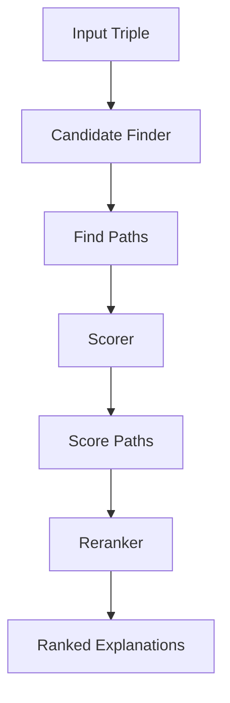

# Overview

Hakken Explainer is designed to explain predictions made by Knowledge Graph Embedding (KGE) models. It does this by finding paths between entities in the knowledge graph and evaluating how well these paths support the predicted relationships.

## How It Works

The explanation process follows these steps:

1. **Candidate Finding**: Identify potential explanation paths between the subject and object entities
2. **Scoring**: Evaluate each path's ability to support the prediction
3. **Reranking**: Order explanations by relevance and quality

## Core Concepts

### Explanation Paths

An explanation path is a sequence of facts (triples) that connect the subject entity to the object entity. For example, if we want to explain why a model predicts `(Alice, worksAt, CompanyX)`, a path might be:

```
(Alice, knows, Bob) → (Bob, worksAt, CompanyX)
```

This path suggests that Alice works at CompanyX because she knows Bob, who works there.

### Scoring Methods

Hakken Explainer supports two types of scoring:

- **Sufficient Scoring**: Measures whether a path alone is enough to justify the prediction
- **Necessary Scoring**: Measures whether a path is required for the prediction

### Candidate Finders

Different strategies for finding explanation paths:

- **Corpus-based**: Finds paths directly in the knowledge graph
- **Latent space**: Uses path generative models to find paths beyond the known knowledge.

## Workflow



## Key Components

- **[HakkenExplainer](api/explainers.md)**: Main class that orchestrates the explanation process
- **[CandidateFinder](api/candidate-finder.md)**: Base class for finding explanation paths
- **[ExplainerScore](api/scores.md)**: Base class for scoring paths
- **[ExplanationReranker](api/reranker.md)**: Base class for ranking explanations

## Next Steps

- Learn about [Candidate Finders](candidate-finders.md)
- Understand [Scoring Methods](scoring-methods.md)
- Explore [Architecture](architecture.md)

